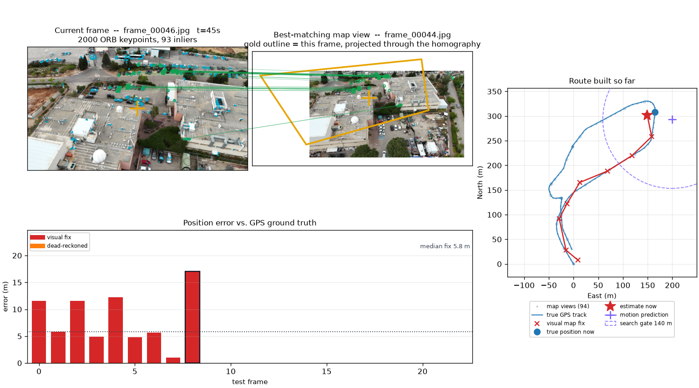

# GPS-Denied Visual Navigation

A drone loses GPS. Can it work out where it is from the camera alone?

This system says yes, by treating localization as **map matching**. A
georeferenced map is built beforehand; then each incoming frame is matched
against it with ORB features, a RANSAC homography is fitted, and the frame's
centre is projected through that homography onto a map view whose position is
known — which turns a pixel offset into a latitude and longitude.

Three ideas carry it:

- **Trust geometry, not popularity.** A confidently *wrong* match produces plenty
  of feature matches that scatter. Acceptance is decided by RANSAC inlier count
  and by sanity checks on the projected footprint, which must stay convex and
  roughly the right size.
- **Use physics to bound the search.** A constant-velocity motion model predicts
  where the drone should be and restricts matching to map views within physical
  reach. That kills perceptual aliasing (one car park looks like another), and it
  keeps the per-frame cost proportional to the local neighbourhood rather than to
  the size of the map — which is what makes it real-time.
- **The map is a swappable component.** It can be the flight's own earlier frames,
  a north-up orthomosaic stitched from them, or real satellite imagery. All sit
  behind one interface, so the matcher never changes.

When nothing is trustworthy the system degrades instead of failing: it reports a
dead-reckoned position, flagged as lower confidence, rather than dropping the
frame.

**Headline result:** 6.5 m median error over held-out frames, localized with no
GNSS. Full measurements are in [`RESULTS.md`](RESULTS.md); the design rationale,
assumptions and limitations are in [`DESIGN.md`](DESIGN.md).

---

## Running it

```bash
./run.sh
```

That is the whole setup. It creates the virtualenv on first use, installs the
requirements, and opens a window listing the flight videos under `data/` — with a
**Browse** button for any other video on your computer. Pick one, press **Start**.

Any video works so long as its telemetry sits beside it: `FLIGHT.MP4` needs
`FLIGHT.SRT` in the same folder. Requires `ffmpeg` on the PATH.

Frames are extracted to a temporary folder when you press Start and deleted when
you leave — nothing is cached between runs, and nothing is reused.



**Frame by frame** (above) — the image being processed with its ORB keypoints, the
map view it matched, this frame's footprint projected onto that map view in gold,
the route built so far, and the error against ground truth. The table on the right
lists every map view considered and, for the ones that lost, *why*.

**Live flight** — the real video playing at the speed it was flown, with the route
drawing itself as the navigator works. Nothing is computed before it is due, so
the delay before a fix appears is the real one; the status bar reports that
latency and whether it is keeping up.

## Batch pipeline

To reproduce the measurements rather than watch them:

```bash
python run_pipeline.py                  # writes results/<flight>/
./reproduce.sh                          # every experiment in RESULTS.md
python summarize.py                     # just re-print committed results
```

Useful flags (`--help` for the rest), shared by the pipeline and the player:

| flag | meaning |
|---|---|
| `--map-source flight\|ortho\|gis\|hybrid` | what the map is made of |
| `--basemap <image>` | satellite raster for `gis` / `hybrid` |
| `--split interleave\|tail` | how frames are divided into map vs. test |
| `--no-motion` | disable the motion model (ablation) |
| `--no-calibrate` | use the modelled camera geometry instead of the measured one |
| `--use-cached-frames` | reuse `data/frames/` instead of re-extracting |

## Using satellite imagery

```bash
python tools/fetch_basemap.py --flight data/raw/flight.srt --source google
python run_pipeline.py --map-source hybrid --basemap data/basemap/flight.jpg
```

`hybrid` uses both maps as **tiers**: trust the previous flight's video, and fall
back to the satellite raster only for frames the video cannot explain. When that
happens the player says so — the map panel turns purple, titles itself
**GIS FALLBACK**, and shows the satellite tile the position was measured from.

The measured answer is that satellite imagery mostly *fails* with classical
descriptors, because the drone camera is oblique and sees building facades while
the map is nadir and shows roofs. That negative result, and the evidence for it,
is the main finding of the final project — see [`RESULTS.md`](RESULTS.md).

## Checking and layout

```bash
python tools/check_flights.py     # drives the real UI over every video in data/
python tools/check_player.py      # proves the player shows what the report measures
python tools/benchmark.py         # per-frame timing against the real-time budget
```

| file | role |
|---|---|
| `src/localize.py` | matching, verification, and the navigation loop |
| `src/motion.py` | the constant-velocity model and its gates |
| `src/calibrate.py` | measures scale and heading from the reference track |
| `src/session.py` | preprocessing and CLI flags, shared by every front-end |
| `src/gis_reference.py`, `src/orthomosaic.py` | raster maps |
| `src/trace.py` | a seekable record of what the navigator did per frame |
| `nav_player.py`, `ui/` | the entry window, the player, and live playback |
