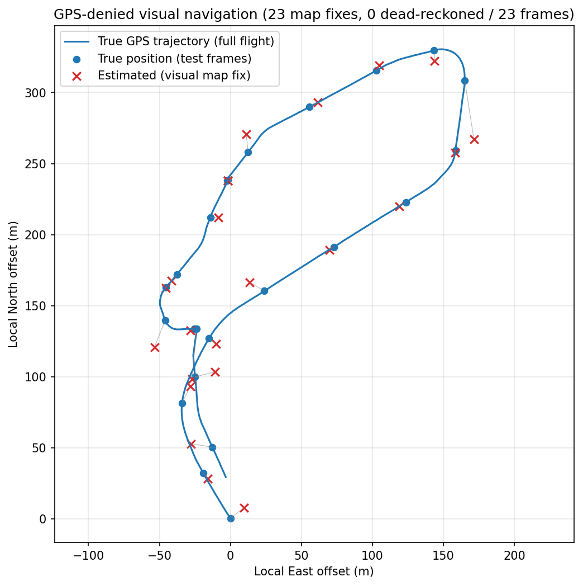

# GPS-Denied Visual Navigation MVP

> **Reviewing this? Start with [RESULTS.md](RESULTS.md)** — one page, the headline
> numbers, and the two defects that were found and fixed.
> [PROJECT_OVERVIEW.pdf](PROJECT_OVERVIEW.pdf) is the same story in plain language,
> for a non-specialist reader. `python summarize.py` prints the results table from
> the committed reports in one second, with nothing to install. To re-run the
> pipeline, drop the flight videos and their `.srt` files into `data/raw/` (too
> large to commit) and run `./reproduce.sh`.
>
> **Note on the description below:** the default experiment is no longer the
> "first 80% / last 20%" split described in this section. On these flights the
> last 20% is the return leg flown back over the mapped ground on the *opposite*
> heading, which ORB cannot match — so that split measured the failure of
> appearance matching across a 180-degree revisit rather than the accuracy of the
> navigator. The default is now an interleaved hold-out with a temporal exclusion
> window; `--split tail` reproduces the original. Metres-per-pixel is likewise no
> longer modelled from FOV + `rel_alt` + an assumed gimbal pitch (wrong by ~36%
> here) but measured from the reference track during preprocessing — see
> `src/calibrate.py`, or `--no-calibrate` for the old behaviour. RESULTS.md has
> the evidence for both.

## Problem statement

GNSS (GPS) signals can be jammed, spoofed, or simply unavailable, yet a drone
still needs to know roughly where it is. This MVP demonstrates the core idea
behind GPS-denied visual navigation: if you have a *georeferenced reference*
of a place (in this case, an earlier segment of the same flight, with known
GPS per frame), you can localize a *new, GPS-less* view of that place by
matching it visually against the reference and projecting the match back into
real-world coordinates. Concretely, this project takes one DJI drone flight
video with known telemetry, treats the first 80% of it as a "known" reference
map and the last 20% as if its GNSS were unavailable, and estimates the ground
coordinate under each last-20% frame's center using classical image feature
matching **fused with the non-GNSS telemetry** (barometric height, camera
angle, and a motion model seeded from the reference track) — then compares the
estimate against the real GPS from the flight log.

This directly targets the assignment's core problem: *"given new real-time
flight data (video + telemetry, without GNSS), compute in real-time the
coordinate of the center point of the video, assuming the preprocessing data
contains the current position."* The reference set is the preprocessing; the
motion-gated, inlier-verified matcher is the real-time navigation loop; and the
output is the video-center ground coordinate.

### What sensor data is used (and why it's fair under GNSS denial)

The DJI SRT gives per-frame `latitude/longitude`, `rel_alt`/`abs_alt`
(barometric), `focal_len`, and exposure — at 30 fps. Under GNSS denial the
*test* frames' lat/lon are withheld (used only for scoring), but the rest is
legitimately available in a real GPS-denied flight and is now actually used:

- **Barometric height** (`rel_alt`) → ground-sample-distance (meters-per-pixel).
  A barometer keeps working when GNSS is jammed, so this is fair to rely on.
- **Camera angle** → slant-range correction of the GSD. This flight's SRT has no
  gimbal field, so the assignment's known 60° angle is used as the fallback.
- **Reference-track GPS** (preprocessing only) → seeds a constant-velocity
  **motion model** and resolves each reference frame's **heading**. The test
  frames then dead-reckon + visually correct with *no* test-frame GNSS.

### Does it need prior knowledge of the course? (and what if it doesn't have it)

Yes — and this is fundamental, not a shortcut. Any method that recovers an
*absolute* position from images needs *some* georeferenced reference of the area
being overflown. Vision without a map can only measure *relative* motion (visual
odometry), which drifts without bound. So there are three regimes, and this repo
is built to span all three:

1. **Known course (implemented, measured here).** The reference is an earlier
   georeferenced segment of the same flight. This is the MVP.
2. **No prior video of the course → use a GIS map (Google Earth).** The honest
   answer to "what if it doesn't know the course" is: swap the reference source
   from prior-flight frames to a georeferenced map that already covers
   everywhere. The navigator is given a **starting position**, propagates it with
   the motion model, and **corrects against map tiles** pulled from a *radius of
   interest* around the current estimate — exactly the loop already implemented,
   with the reference source changed. See "Extending to GIS / Google Earth". (The
   hard part there is matching an oblique drone frame to a nadir map tile, which
   needs a learned matcher — noted as future work.)
3. **No map at all, momentarily → coast on motion.** When *no* trustworthy match
   is available for a frame, the navigator does **not** reject it: it reports a
   **dead-reckoned** position from the motion model (flagged, lower-confidence)
   and keeps going. This is graceful degradation, like an INS bridging a GPS
   dropout.

**A measured caveat on regime 3 (important):** relying on motion *alone* only
works for short gaps here, because this dataset has **no IMU** and the SRT gives
no inertial data. Two things were tested:

- **Visual odometry** (estimate motion from consecutive frames): on this 1 Hz,
  oblique-60° video it did *not* track the drone — magnitude correlation with
  true GPS displacement was ≈ 0 (it produced 55 m single-step jumps vs a true
  12 m max). Too noisy to integrate, so it is *not* used.
- **Constant-velocity coasting**: uncapped, it diverged to ~500 m over a long
  gap (the drone hovers and turns, so last-known velocity stops being valid).
  It is therefore **capped** (`dead_reckon_report` in `src/motion.py`) to a short
  extrapolation then hold-near-last-fix, which keeps dead-reckon error bounded
  (~100 m here) instead of runaway. The takeaway that answers the question
  directly: *without a motion sensor you cannot navigate on movement alone — the
  map (prior video or Google Earth) is what makes it work; motion only bridges
  the gaps.*

## Related work

- **Cross-view drone geo-localization benchmark.** Zheng, Wei & Yang, *University-1652: A Multi-view Multi-source Benchmark for Drone-based Geo-localization*, ACM Multimedia 2020 ([paper](https://arxiv.org/abs/2002.12186), [code](https://github.com/layumi/University1652-Baseline)). Establishes the standard drone/satellite/ground multi-view retrieval benchmark that most learned cross-view geo-localization work (including the University-1652-style approaches referenced below) is trained and evaluated against. This project doesn't use a learned retrieval model, but the benchmark defines the harder version of the problem this MVP simplifies away by keeping reference and test images same-flight, same-viewpoint-family.
- **Classical (non-deep) feature-based UAV image registration.** Luo, Wei, Jin, Wang, Lin, Wei & Zhou, *Fast Automatic Registration of UAV Images via Bidirectional Matching*, Sensors 2023 ([paper](https://pmc.ncbi.nlm.nih.gov/articles/PMC10610563/)). Uses the same core primitives as this project — ORB keypoints, Hamming-distance descriptor matching, and a RANSAC-family outlier filter (PROSAC here vs. `cv2.findHomography`'s RANSAC in `src/localize.py`) — but adds bidirectional (forward/backward) matching consistency checks before accepting a match. That's a concrete, low-effort improvement this MVP doesn't implement: currently a test frame is matched to references in one direction only, with no check that the reference frame's best match points back to the same test frame.
- **GPS-denied UAV localization via reference-imagery matching, with code.** Goforth & Lucey, *GPS-Denied UAV Localization using Pre-existing Satellite Imagery*, ICRA 2019 ([paper](https://publications.ri.cmu.edu/gps-denied-uav-localization-using-pre-existing-satellite-imagery), [code](https://github.com/hmgoforth/gps-denied-uav-localization)). Solves the same top-level problem as this project (replace GPS by matching a live UAV frame against a pre-existing georeferenced reference), but where this MVP uses ORB descriptors, they fine-tune a CNN (VGG16) on satellite imagery specifically because hand-crafted features degrade under the seasonal/appearance and viewpoint differences between UAV and satellite imagery — the same failure mode flagged in this project's limitations section.
- **Viewpoint gap between oblique UAV imagery and nadir reference imagery.** Kinnari, Verdoja & Kyrki, *GNSS-denied geolocalization of UAVs by visual matching of onboard camera images with orthophotos*, 2021 ([paper](https://arxiv.org/abs/2103.14381)). Directly addresses this project's largest unmodeled error source: rather than assuming a nadir (straight-down) camera, they orthorectify the UAV image under a local-planarity assumption before matching, which removes the oblique-viewpoint distortion instead of only correcting its average scale the way this project's slant-range GSD correction does (see Limitations — a single per-frame GSD doesn't model the trapezoidal ground footprint of an oblique shot).

## Algorithm

```
 flight.srt ──► [1] parse_srt ──► telemetry table (t, lat, lon, alt, gimbal)
                                        │
 flight.mp4 ──► [2] extract_frames ─────┤ (attach nearest telemetry per frame)
                                        ▼
                              tagged frames (chronological)
                                        │
                     [3] split 80% / 20% ──────────────┐
                          │                             │
                          ▼                             ▼
                 reference frames                  test frames
                          │                             │
              [4] build_reference                       │
              (ORB features + known GPS                 │
               + resolved heading)                      │
                          │                             │
                          │      ┌─── real-time loop (per test frame) ────┐
                          │      │  motion model PREDICTS position         │
                          └──────┤  [5] query ReferenceSource for a        │
                                 │      RADIUS OF INTEREST (dynamic tiles)  │
                                 │  [5] match neighborhood (BF+ratio),      │
                                 │      take top-K candidates               │
                                 │  [6] homography (RANSAC) per cand.;      │
                                 │      pick best by INLIER count           │
                                 │  accept iff inliers/ratio pass           │
                                 │  [7] center px → m (GSD) → lat/lon,       │
                                 │      rotated by ref heading (UTM)        │
                                 │  INNOVATION GATE: reject impossible jump │
                                 │  ├─ accepted → MAP FIX, update model     │
                                 │  └─ else      → DEAD-RECKON (coast),     │
                                 │                 report flagged position  │
                                 └──────────────────────────────────────────┘
                                        │
                              [8] evaluate vs true GPS (median/mean/rmse/p90/max)
                                        │
                              [9] visualize trajectory (PNG)
```

1. **Parse telemetry** (`src/parse_srt.py`): regex-based parser reads the
   DJI `.srt` file's subtitle blocks and extracts timestamp, GPS lat/lon,
   altitude, and gimbal pitch/yaw (when present). Blocks that don't contain
   parsable GPS fields are logged and skipped, not treated as fatal errors,
   since real-world DJI SRT files vary in field naming across firmware
   versions.
2. **Extract frames** (`src/extract_frames.py`): `ffmpeg` extracts frames at
   a fixed rate (default 1 Hz, configurable). Each frame is tagged with the
   nearest telemetry record by timestamp.
3. **Split reference/test** (`src/build_reference.py`): the first 80% of
   frames (chronologically) become the "known" reference set; the last 20%
   become the test set, whose GPS is only used for evaluation afterward.
4. **Build reference index** (`src/build_reference.py`): ORB keypoints and
   descriptors are computed for every reference frame and kept in memory
   together with that frame's known GPS, altitude, gimbal angle, and a
   **resolved heading** (measured gimbal yaw if present, else the GPS
   travel-bearing estimate). `ReferenceEntry` is deliberately *source-agnostic*
   (see "Extending to GIS / Google Earth" below): today each entry is a
   same-flight frame, but the same struct describes a georeferenced map tile.
5. **Match test frame → reference, with a motion gate** (`src/localize.py`,
   `src/motion.py`, `src/reference_source.py`): a constant-velocity **motion
   model** — seeded from the reference track and propagated using only previous
   *estimates* (no test-frame GNSS) — predicts where the drone is, and the
   **`ReferenceSource` is queried for only the views within a radius of interest**
   of that prediction. This both eliminates *perceptual aliasing* (matching a
   look-alike from a distant part of the flight) and is the hook for **lazily
   loading map tiles instead of holding the whole map** in memory. ORB
   descriptors are brute-force Hamming-matched (Lowe ratio test) against that
   neighborhood, keeping the top-K candidates by good-match count.
6. **Homography + inlier confidence** (`src/localize.py`): each top-K candidate
   is verified with a `cv2.findHomography` RANSAC fit, and the candidate with
   the most **geometric inliers** is chosen — *not* the one with the most raw
   matches, which is what previously picked confident-but-wrong frames. A frame
   is accepted only if it clears `--min-inliers` (default 6) and
   `--min-inlier-ratio` (default 0.12); otherwise it's an honest localization
   failure, not a fabricated position. If the gate is *empty* (no reachable
   reference), a global re-acquisition search runs under a stricter bar.
7. **Center pixel → ground coordinate** (`src/localize.py`): the test frame's
   center is mapped through the homography into the reference frame's pixel
   space; the pixel offset from the reference center is converted to meters via
   ground sample distance (slant range from **barometric altitude** + the DJI
   Mini 3 Pro's ~82.1° diagonal FOV split by the 16:9 aspect ratio, accounting
   for the ~60° gimbal tilt), rotated into world East/North by the reference
   frame's resolved heading, and applied to the reference GPS via UTM. The
   result is the ground coordinate under the video center — the assignment's
   target output. Finally an **innovation gate** rejects any estimate implying
   an impossible jump from the last confirmed fix (a standard tracking-filter
   check); accepted estimates update the motion model for the next frame.
7b. **Dead-reckon fallback** (`src/localize.py`, `src/motion.py`): if no match
   is trustworthy (or the innovation gate rejected it), the frame is **not**
   dropped — the navigator reports a **dead-reckoned** position by coasting the
   motion model (capped extrapolation, then hold-near-last-fix so it can't run
   away), flagged with a `dead_reckon` mode and a coast counter. Graceful
   degradation, like an INS bridging a GNSS dropout.
8. **Evaluate** (`src/evaluate.py`): for every successfully localized test
   frame, the haversine distance (meters) to the SRT's true GPS is computed.
   Because the error distribution is bimodal, **median / mean / RMSE / p90 /
   max** are all reported, plus a breakdown of in-gate vs. re-acquired matches.
9. **Visualize** (`src/visualize.py`): the true GPS trajectory (full flight,
   from the SRT) and the estimated positions (test frames only) are
   projected into local x/y meters via UTM and plotted together, saved to
   `results/trajectory_comparison.png`.

## How to run

**Just want to see it work?** `./run.sh` sets everything up and opens the
interactive navigator — see "Watching it run" below. The rest of this section is
the batch pipeline that produces the measured results.

```bash
git clone <this-repo>
cd visual-nav-mvp

python3 -m venv venv
source venv/bin/activate
pip install -r requirements.txt

# macOS: install ffmpeg if you don't already have it
brew install ffmpeg

# Place your flight data here:
#   data/raw/flight.mp4
#   data/raw/flight.srt

python run_pipeline.py
```

Useful flags (see `python run_pipeline.py --help`):
- `--rate` — frame extraction rate in Hz (default 1.0)
- `--ref-fraction` — fraction of frames used as the reference set (default 0.8)
- `--min-good-matches` — minimum good matches to accept a localization (default 15)
- `--min-inliers` — minimum RANSAC inliers to accept a localization (default 6)
- `--min-inlier-ratio` — minimum RANSAC inlier ratio to accept (default 0.12)
- `--top-k` — top match candidates to verify by homography inliers (default 5)
- `--gimbal-pitch` — assumed camera angle in degrees (0=horizontal, -90=nadir) used when the SRT has no gimbal field (default -60)
- `--fuse` — enable multi-reference fusion (opt-in; measured wash-to-negative, see "Generalization across flights")
- `--no-motion` — disable the motion model / spatial gating (pure image matching, for ablation)
- `--max-seconds` — only process the first N seconds (useful for a quick smoke test on a placeholder clip)
- `--video` / `--srt` — override the default `data/raw/flight.mp4` / `data/raw/flight.srt` paths

The same flags drive `nav_player.py` (see "Watching it run" below), which steps
through this pipeline interactively.

If `data/raw/flight.mp4` / `data/raw/flight.srt` are missing, the script prints
a clear error telling you where to place them instead of crashing.

## Watching it run

`run_pipeline.py` navigates a whole flight and writes a report. To *watch* the
same navigation happen, frame by frame:

```bash
./run.sh
```

That is the entire setup. It creates the virtualenv on first use, installs the
requirements, and opens an entry window listing every flight video it finds under
`data/` — with a **Browse** button for any other video on your computer. Pick one,
press **Start**, and it decodes the flight, builds the map and opens the player.


### Nothing is precomputed, and nothing is kept

The app never reads `data/frames/` and never writes to it. When you press Start it
extracts frames into a temporary folder (`src/workspace.py`), uses them, and
deletes them the moment you open another flight or close the window. That costs
about a minute of ffmpeg per flight and buys two things worth more: it opens *any*
video you point it at, and it can never quietly show you a stale run that some
earlier session left behind. **Cancel** during preparation stops ffmpeg and cleans
up immediately.

Any video works, so long as its telemetry sits beside it: `FLIGHT.MP4` needs
`FLIGHT.SRT` in the same folder (the match is case-insensitive). If the entry
window shows *"— none found —"*, use **Choose telemetry…** to point at the right
file. `.mp4`, `.mov`, `.mkv`, `.avi`, `.m4v`, `.webm` and friends are all offered.

Before you start, the window tells you what you are in for — *"≈ 117 frames to
extract, ≈ 23 of them navigated against a map of ≈ 94"* — and you can lower the
sample rate or clip the flight to its first N seconds if that is more than you
want to sit through.

### What the panels show

| panel | what it shows |
|---|---|
| **Current frame** | the image the matcher is working on, every ORB keypoint it found, and the subset that survived RANSAC as inliers |
| **Best-matching map view** | the reference frame (or map tile) it chose, with this frame's footprint projected onto it through the homography. That gold outline *is* the localization — its centre is the estimated position |
| **Route** | the true GPS track and the trajectory built so far, drawn as it goes: red = trusted visual fix, orange = dead-reckoned, dashed circle = the motion model's search gate |
| **Error** | metres from ground truth per frame, filling in as it runs |

Beside the figure, a table lists every map view the frame was actually compared
against — good matches, inliers, and if it lost, *why* (degenerate homography,
centre projected off the view, or simply below the acceptance bar). Clicking a
row explains it. That table is the difference between showing the answer and
showing the reasoning.

Controls: play/pause, step, jump to either end, a frame scrubber, a playback-rate
box, toggles for keypoints / match lines / follow-the-drone, **Open another
flight** to go back to the entry window, and **▶ Live flight** (below). From the
keyboard: `space` play/pause, `←`/`→` step, `shift+←/→` jump five, `Home`/`End`.

### Live flight

The frame-by-frame player is for studying one decision. **▶ Live flight** shows
the other half: the real video playing at the speed it was flown, with the route
drawing itself as the navigator works.

**Nothing is computed before it is due.** A frame is localized only once playback
actually reaches its moment in the flight, and the fix appears on the route when
the computation finishes — so what you watch is the true latency between the drone
being somewhere and the navigator knowing it. (Running the work ahead and
replaying it on a timer would look identical and prove nothing, which is why it
does not do that.)

The status bar reports that latency against the time available, and says plainly
whether it is keeping up. Measured: ~240 ms per fix against a 5 s frame spacing at
1x, so there is a lot of slack — and raising the speed eats it. On the hybrid map
at 8x the navigator has 625 ms per frame, needs 746 ms, and the readout switches
to **FALLING BEHIND** with the lag in seconds rather than hiding it.

Playback speed is selectable (0.5x–4x), the video carries a banner saying whether
the current position is a visual fix, a dead-reckoned coast or a **GIS fallback**,
and the route and error chart colour each position by how it was obtained.
**Restart** rewinds the navigator too, so a second run re-does the work rather
than replaying the first run's answers.

It needs the source video, so it is offered whenever the flight was opened from a
real `.mp4` (which the entry window always does).

Stepping forward past what has been navigated runs the real algorithm right
then — roughly a quarter-second per frame — so play really is the navigator
working, not a recording. Frames already visited are cached in memory, so
scrubbing backwards is immediate.

### Straight to a flight, and the ablation flags

Naming a flight on the command line skips the entry window, which is what you
want for a demo — and it is the only way to reach the options the window does not
expose:

```bash
python nav_player.py --video data/raw/flight.mp4 --srt data/raw/flight.srt
python nav_player.py --video data/raw/flight.mp4 --srt data/raw/flight.srt \
    --map-source ortho --no-motion
```

It accepts every flag `run_pipeline.py` accepts — both share `add_pipeline_args`
in `src/session.py` — so `--map-source`, `--split`, `--no-motion` and the rest
mean exactly the same thing here, which makes it an ablation viewer as well as a
demo. Frames still go to a temporary folder unless you pass `--frames-dir` or
`--use-cached-frames`; the latter is the one way to make it reuse `data/frames/`,
and then it is on you that those frames match the video.

### Checking it on your own videos

```bash
python tools/check_flights.py            # first 45 s of every flight under data/
python tools/check_flights.py --full     # every flight, end to end
```

This drives the **real** window for every video it finds and every map source that
video can offer: select it, press Start, wait for preprocessing, step through the
player, switch to live playback, and return to the chooser — checking the scratch
directory is erased each time. It is what catches the things a unit test cannot,
like a map source that only fails on one flight.

It distinguishes three outcomes. `ok` means the flight ran. `declined` means the
app refused with a reason and stayed usable — for example, an orthomosaic map
needs self-calibration, and a clip that is short or mostly hover does not give
enough moving frame pairs to calibrate from; you get that explanation rather than
a traceback. Anything else is a real `FAILED`.

### It shows what the report measures

Nothing in the player re-implements the algorithm. `src/trace.py` drives
`localize_stream` — the same generator `localize_all` collects — and records the
`debug` dict `localize_frame` fills in, so what you watch is by construction what
the report measured. `python tools/check_player.py --use-cached-frames` proves it
rather than asserting it: headless, it runs the batch pipeline and the traced one
over the same session and checks they agree frame for frame.

### How the code is laid out

| file | role |
|---|---|
| `nav_player.py` | entry point: open the window, or go straight to a named flight |
| `ui/launcher.py` | the entry window, the preparation screen, and the app that switches between them |
| `ui/player.py` | the player window — four panels and the transport controls |
| `ui/live.py` | live playback — real video at flight speed, route building as it runs |
| `src/trace.py` | a seekable, lazily-computed record of what the navigator did per frame |
| `src/workspace.py` | the temporary directory, erased however the run ends |
| `src/session.py` | preprocessing and the CLI flags, shared with `run_pipeline.py` |

## Results

Results below are from a real DJI Mini 3 Pro flight (`data/raw/flight.mp4` /
`flight.srt`, ~118 seconds, ~50m altitude, 60-degree gimbal angle), extracted
at the default 1 Hz (118 frames: 94 reference / 24 test). This flight's SRT has
neither gimbal pitch nor yaw fields (confirmed by grepping the raw file), so the
camera-angle and heading fallbacks are active for every test frame here.



```
Test frames total:       24
Trusted map fixes:       14
Dead-reckoned (coasted): 10     <- still reported, flagged lower-confidence
No estimate at all:       0

Error (m) vs true GPS, by mode:
  map fixes (14):    median 43.47  mean 41.89  rmse 48.48  p90 67.59  max 93.49
  dead-reckon (10):  median 99.1   mean 97.5   rmse 99.1              max 123.5
  all reported (24): median 64.7   mean 65.1   rmse 73.9             max 123.5
```

Every frame gets a position (**24/24 coverage**), but the two modes are reported
separately because they mean different things: a *map fix* is a trusted visual
lock; a *dead-reckon* is the drone coasting on its motion model through a gap
where no match was trustworthy.

**Compared to the original pure-image-matching version** (which reported 24/24
"successes" but with silent 200m+ errors mixed in — mean 77.55 m, max 260.85 m):

| Metric | Before (pure matching) | After (sensor-fused) |
|---|---|---|
| Trusted fixes | 24/24 *(incl. silent fabrications)* | 14 map fixes *(+10 flagged dead-reckon)* |
| Coverage | 24/24 | 24/24 |
| Mean error (trusted) | 77.6 m | **41.9 m** |
| Max error (trusted) | 260.9 m | **93.5 m** |
| Worst error anywhere | 260.9 m *(reported as good)* | **123.5 m** *(flagged dead-reckon)* |

The improvement comes from **using the telemetry, not just pixels**, and from
being honest about confidence. Ablations on this flight (toggle with
`--no-motion` and the `--min-inliers*` flags):

- **Inlier-based confidence** (accept on RANSAC geometric inliers, not raw
  match count) is what stops confident-but-wrong matches being reported as
  successes. Raw match count could not tell a correct match from an aliased
  one; inlier count can.
- **Motion gating** (spatial + innovation gate) is what removes the large
  outliers: the worst error dropped from ~190 m to ~93 m once physically
  impossible matches/jumps were rejected. Per-frame inspection shows the gate
  correctly *admits* same-area loop revisits (e.g. a test frame matching a
  reference frame ~80 frames earlier that is spatially nearby) while rejecting
  matches to genuinely distant look-alikes.
- The **residual ~40 m median** is the honest accuracy floor of this setup:
  1 Hz sampling, an oblique 60° view, a single uniform GSD per frame, and no
  true yaw/compass (so heading comes from GPS travel-bearing, which is
  undefined during the frequent hovering in this flight). These are the next
  levers — see limitations.

### Generalization across flights

The same code and defaults were run unchanged on four separate DJI Mini 3 Pro
flights over the same area but at different altitudes, durations, and path
lengths (each writes to `results/<flight>/`). No parser changes were needed and
**no frame ever fully failed** (0 "no estimate") — dead reckoning always keeps
coverage at 100%.

| Flight | Alt (m) | Path | Frames | Map fixes | Map-fix median | Map-fix max |
|---|---|---|---|---|---|---|
| `flight`      | ~50    | 0.9 km | 24 | 14 | **43 m** | 93 m |
| `flight_0024` | ≤34    | 0.9 km | 28 | 16 | **17 m** | 125 m |
| `flight_0023` | 0–101  | 4.5 km | 70 | 43 | **41 m** | 169 m |
| `flight_0017` | 20–120 | 2.0 km | 51 | 22 | **76 m** | 266 m |

The clear trend is **accuracy scales with altitude**: the low-flying `flight_0024`
(≤34 m) is best (17 m median) because each pixel covers less ground, while the
high, climbing `flight_0017` (up to 120 m) is worst (76 m) — a single uniform GSD
and heading error both cost more meters-per-pixel at altitude. Longer flights
(`flight_0023`) get a higher *share* of map fixes (more reference coverage of the
area) but a fatter error tail. This is the expected physical behavior and points
straight at the open levers below (per-row GSD, true yaw, denser sampling).

Run any flight yourself:

```bash
python run_pipeline.py --video data/raw/flight_0024.mp4 --srt data/raw/flight_0024.srt
# outputs -> results/flight_0024/{error_report.txt,trajectory_comparison.png}
# --gimbal-pitch lets you set a per-flight camera angle (default -60)
```

**A measured negative result (multi-reference fusion, `--fuse`).** I hypothesized
that averaging several accepted matches (inlier-weighted) would cut variance
versus trusting a single best match. Tested across all four flights it was
*wash-to-negative*: it helped the hardest high-altitude flight (`flight_0017`
mean 109→97 m) but hurt others (baseline `flight` max 93→143 m, `flight_0023`
median 41→49 m), because averaging in a spatially-different-but-still-accepted
reference (a loop revisit) pulls the estimate off when the single best match was
already good. So it's kept as an **opt-in flag**, and the robust **single
best-inlier match is the default** — an honest example of validating an idea and
letting the measurement, not the intuition, decide.

## Limitations / future work

- **No yaw compensation without SRT yaw**: if the telemetry doesn't include
  gimbal/camera yaw, a travel-bearing estimate (direction of travel between
  nearby GPS samples) is used as a proxy, falling back further to a
  north-aligned camera only if that's unavailable too (e.g. a hovering
  reference frame with negligible GPS displacement). The travel-bearing proxy
  assumes the camera faces the direction of travel, which breaks down during
  hovering, orbiting, or independent gimbal panning — this flight's SRT has
  no yaw field at all, so this assumption was active for every test frame,
  and it's the likely explanation for the largest remaining errors (frames
  near the loop's turn, where the drone wasn't flying straight).
- **Classical (ORB) features only**: by design, this MVP uses only classical
  OpenCV features, not deep-learned matchers (SuperGlue, LoFTR, etc.). This
  keeps the dependency list light and setup fast, but it would likely fail on
  cross-view matching against satellite/GIS reference imagery, since the
  viewpoint gap between an oblique drone frame and a nadir satellite image is
  much larger than between two drone frames from the same flight — a known
  harder extension, out of scope here.
- **Same-flight reference only (by default)**: the reference set is drawn from
  the same video as the test set, not from an independent map or an orthomosaic.
  It demonstrates the localization mechanism, not a production mapping pipeline —
  but the `ReferenceSource` seam (see "Extending to GIS / Google Earth") is
  exactly what an independent-map / Google-Earth backend plugs into.
- **Dead reckoning is short-gap only**: with no IMU and unreliable visual
  odometry on this data (see "Does it need prior knowledge of the course?"),
  motion-only bridging is capped and coarse (~100 m here). It keeps 24/24
  coverage but is not a substitute for map fixes; long dropouts need a denser
  map / better matcher, not better coasting.
- **No lens distortion correction**: frames are matched and projected as-is,
  without correcting for camera lens distortion.
- **Still only a single, uniform ground sample distance per frame**: the
  meters-per-pixel conversion now uses slant range (accounting for gimbal
  tilt away from nadir — see step 7 above) rather than raw altitude, which
  corrects the systematic bias of a pure nadir assumption. It still applies
  one GSD value to the whole frame, though: a truly oblique shot's ground
  footprint is trapezoidal (the top of the frame is farther from the camera,
  and therefore covers more ground per pixel, than the bottom), which this
  MVP does not model per-row.
- **ORB may fail on low-texture terrain**: water, uniform fields, or other
  textureless surfaces can yield too few keypoints for reliable matching,
  which is exactly why failed localizations are explicitly detected and
  excluded rather than silently producing bad estimates.

## Real-time navigation loop

The localizer is structured as an online predict → gate → match → correct loop
(`localize_stream` in `src/localize.py`, which `localize_all` collects), which is
exactly the shape a real-time navigator needs:

1. **Predict** the next position from the motion model (constant velocity,
   dead-reckoned from the last fix — this alone works during short visual
   dropouts).
2. **Gate** the reference index to physically reachable candidates. This also
   makes matching *cheaper* as the reference map grows: instead of brute-forcing
   every reference frame, only a local neighborhood is searched.
3. **Match + verify** within the gate, accepting only on geometric inlier
   confidence.
4. **Correct or coast**: fold an accepted fix back into the motion model; reject
   impossible jumps (innovation gate); and when no fix is trustworthy, **report a
   dead-reckoned position** (capped coast) rather than dropping the frame.

Nothing in the loop uses the test frame's GNSS, so it is a faithful stand-in for
the real GPS-denied case. The current bottleneck for true real-time is the
brute-force ORB matcher; a spatial index over the reference set (e.g. a k-d tree
on positions, already half-enabled by the radius query) plus a
BoW/vocabulary-tree or FAISS descriptor index is the natural next step.

## Real-time, measured

`tools/benchmark.py` reports whether the navigator fits the frame budget, where
the time goes, and how the cost scales:

```bash
python tools/benchmark.py --use-cached-frames
python tools/benchmark.py --use-cached-frames --map-source hybrid --basemap data/basemap/flight.jpg
```

At 1 Hz the budget is 1000 ms per frame. Measured: **272 ms** median against the
94-frame flight map (3.7x faster than real time) and **558 ms** against the
346-view hybrid map (1.8x). Descriptor matching is 77–81% of that, and it is
linear in the number of views the motion gate admits — about **5–7 ms per view**,
flat across gate sizes. So the per-frame cost is set by the size of the
*neighbourhood searched*, not the size of the map, which is exactly what gating
buys and what makes a city-scale basemap tractable. Breaking that linearity with
a descriptor index is the next optimisation.

## Using a GIS map, and using both at once

```bash
# fetch a satellite basemap for a flight (needs internet)
python tools/fetch_basemap.py --flight data/raw/flight.srt --source google

# navigate against it
python run_pipeline.py --use-cached-frames --map-source gis  --basemap data/basemap/flight.jpg

# or against the previous flight AND the satellite map, competing per frame
python run_pipeline.py --use-cached-frames --map-source hybrid --basemap data/basemap/flight.jpg
```

`--map-source hybrid` puts both maps behind one `CompositeReferenceSource`, so a
single radius query returns flight frames and satellite tiles together. By
default it runs them as **tiers**: trust the previous flight's video, and consult
the GIS raster only for frames the video could not explain. That is the
operationally useful arrangement — same-sensor imagery is far more reliable over
ground you have flown, so the satellite map is the safety net for the gaps rather
than a competitor. (`--hybrid-policy compete` matches both every frame and keeps
whichever gathered more inliers.)

The error report breaks fixes down by which map produced them, and the player
says so on screen: a fix taken from the satellite map turns the map-view panel
purple, titles it **GIS FALLBACK**, shows the actual satellite tile the position
was measured from, and marks the estimate purple on the route and error charts.

To see it, open `flight_0024` as a hybrid and go to test frame **20** — the
previous-flight map fails there and the satellite map produces a **7.3 m** fix.
Frame **15** is the honest counterpart: the satellite also wins there, and is
344 m wrong.

The measured answer on these flights is that the satellite map wins **nothing**:
ORB, SIFT and AKAZE all fail to match an oblique drone frame to nadir satellite
imagery even when handed the correct patch by a GPS oracle. That negative result,
and the evidence for it, is in `RESULTS.md` — it is the main finding of the final
project, and it is what points at a learned matcher as the next step.

## Extending to GIS / Google Earth (final-project seam)

The professor's final-project idea — *"real-time visual navigation based on
predefined (annotated) previous videos and GIS datasets such as Google Earth"* —
is a change of **reference source only**. Everything downstream (gating,
matching, inlier verification, pixel→ground projection, motion model, dead
reckoning, evaluation) is already source-agnostic. Two seams make this concrete:

- **`ReferenceEntry`** (`src/build_reference.py`) — one georeferenced,
  feature-indexed view. It carries a center `latitude/longitude`, an
  `altitude`-equivalent scale, a `heading_deg`, ORB features, and a `source` tag.
  Today it's a same-flight frame; the same struct describes a map tile.
- **`ReferenceSource`** (`src/reference_source.py`) — access to the map via
  `query(lat, lon, radius)` + `all()`. The navigator only ever asks for the
  *radius of interest* around its current estimate, so a backend is free to load
  and evict tiles on demand: **constant memory regardless of map size**, and
  matching cost bounded by the local neighborhood (real-time as the map grows).

To plug in Google Earth / GIS you would:

1. **Implement `TiledMapReferenceSource(ReferenceSource)`**: given the query
   (lat, lon, radius), load the georeferenced tiles overlapping that disc from
   disk/network, build a `ReferenceEntry` per tile (lat/lon = tile center, GSD =
   the tile's known meters-per-pixel, `source="gis_tile"`), cache them, and drop
   tiles that fall outside the radius. This directly realizes the
   "dynamically change the photos based on a prefixed radius of interest" idea —
   nothing else in the pipeline changes, because it already talks to the map only
   through `query`/`all`.
2. **Handle the wider viewpoint gap.** Map tiles are typically nadir while drone
   frames here are oblique (60°); classical ORB will struggle across that gap.
   This is the point to swap the matcher for a learned one (SuperPoint+SuperGlue,
   LoFTR) or to orthorectify the drone frame first (local-planarity assumption)
   — the matcher lives behind `match_candidates`, so it can be replaced without
   touching the rest of the loop.
3. **Everything else is reused as-is**: give the drone a **start position**, and
   the same predict → query-radius → match → correct → (dead-reckon on gaps) loop
   runs against the map. Motion model, spatial + innovation gates, inlier
   confidence, center-pixel→ground projection, and the evaluation harness all
   operate on `ReferenceEntry`/`ReferenceSource`/`LocalizationResult` and don't
   care whether a reference came from a prior video or Google Earth.

This keeps the current same-flight MVP as the honest, runnable baseline while
laying the exact interface — radius-queried reference source + swappable matcher
+ start-position-and-coast loop — that the GIS extension slots into.
